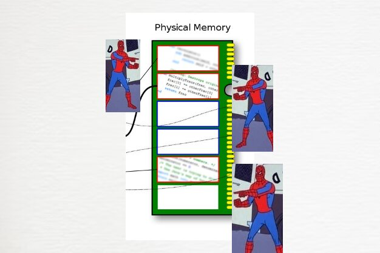
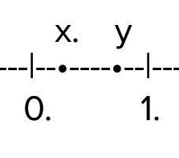
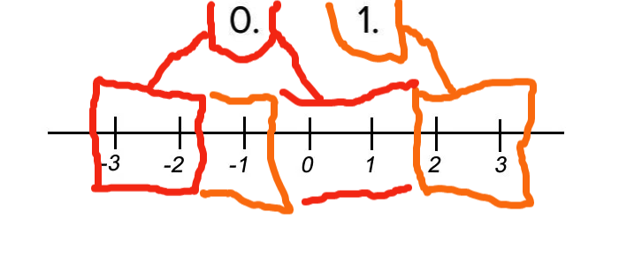

<h1>Diferent-Search</h1>

<h2>O Problema</h2>

Esse projeto tem como desafio a implementação de três formas diferentes de caminhar pela matriz de entrada, aleatoriamente, fazendo uma busca em largura e fazendo uma busca em profundidade. Aqui surge a seguinte questão: como fazer tais caminhamentos?, desta pergunta nasce todas as outras discuções a respeito das contruções desenvolvidas neste projeto.

<h2>Desenvolvimento do Problema</h2>

Para resolver o problema foi necessário trazer respostas aos seguintes questionamentos:

<ul>
    <li>
        Se for necessário entrar com uma grande quantidade de dados, qual estrutura de dados será capaz de suportar tal massa de dados?
    </li>
    <li>
        Como fazer o programa caminhar de maneira aleatória pela matriz de entrada?
    </li>
    <li>
        Como fazer o programa caminhar pela matriz usando o método de profundidade?
    </li>
</ul>

A memória é um recurso utilizado pelo Sistema Operacional para manter informações pertinentes a uma aplicação acessiveis para serem manipuladas, e causar algum efeito em uma aplicação em que o usuário requeriu, porem a mesma é um recurso limitado, e em aplicações com uso de uma grande quantidade de informações essa memória pode não suportar a necessidade de espaço necessária para o programa realizar suas operações, com isso uma alternativa que visa aproveitar esse espaço de maneira inteligente é o uso de alocação dinâmica dos espaços para colocar tal massa de dados.Sendo assim neste projeto foi utilizado diferentes estruturas em virtude do problema fornecido apenas algumas estruturas se adequam para atender as execuções a serem feitas para que os algoritmos sejam executados da maneira correta, no decorrer desta documentação será possível entender isso de forma mais clara, visto que vai ser mostrado que não seria possível fazer o algoritmo fornecer a saída correta se não fossem utilizado as estruturas de dados que foram utilizadas, em resumo a resposta para o primeiro questionamento é que essas estruturas são dinâmicas que não possuem alocação sequencial na memória, o que pode trazer um maior custo de acesso do dado na memória, mas que contornará o erro de segmentation fault que pode vir ocorrer com uma estrutura linear, supondo que fosse alocado um vetor de 2000 casas de maneira linear, a memória vai ser separada pelo Sistema Operacional de maneira sequencial, ou seja cada endereço do vetor vai estar logo após ao atual fisicamente na memória, o que não ocorre na alocação dinâmica da memória, o que se tem é o Sistema Operacional separando espaços de memória aleatoriamente na RAM para alocar as informações o que aumenta o tempo de leitura do dado, mas minimiza o problema de conflito que ocorre com a estrutura linear, e torna o algoritmo um pouco mais tolerante a erros.

Para caminhar de maneira aleatória pela matriz de entrada foi utilizado um recurso da biblioteca time, que é a função rand que seleciona um valor dentro de um intervalo determinado pelo programador e determina um número com base nesse intervalo pegando como base o tempo em segundos desde 1 de Janeiro de 1970 até os tempos atuais. E utilizando a técnica de usar um escopo maior de números, o qual foi extraido do <a href="https://github.com/mpiress/GenerateDataToMaze">algoritmo de geração de matrizes</a> do Michel Pires de número maior do que apenas dois números sendo 0 ou 1 para somar ou subtrair para mudar a linha e a coluna e fazer o algoritmo mudar de posição até que seja encontrado a interrogação, o qual se faz o parametro de parada para o algoritmo, o problema que foi observado foi este:

Inicialmente foi utilizado a função rand()%2 o que vai decidir um número de 0 a 1, ou seja, seria retornado 0 ou 1, isso seria perfeito se o método de escolha da biblioteca time não tendece tanto a repetir um mesmo resultado quando se tem um número menor de possibilidades, nesse caso seria apenas duas possibilidades, e se mostrou ineficiente visto que era retornado muitas vezes apenas uma das possibilidades, porem quando foi apresentado um escopo maior de números como mostra a imagem abaixo: 

Assim o intervalo agora para que fosse decidido entre 0 ou 1 é maior, aumentando o número de possibilidades e tornando o algorítmo um pouco mais randômico.

Na medida que se foi sendo decidido o valor retornado, que tambem contava com o valor -1, pois estamos considerando que vamos caminhar em todas as direções possiveis foi sendo verificado se tinha chegado até uma posição onde a interrogação estava, sendo assim o que ocorreu foi que a cada iteração do algoritmo foi sendo somado um, subtraido um ou permanecendo com o mesmo valor da linha ou coluna que no caso do algoritmo ocorria quando se somava zero a linha ou coluna, e verificado a toda alteração os respectivos indices que foram sendo obtidos, tomando as devidas verificações para que também não houvesse estouro de memória ao acessar posições inexistentes que ultrapassavam os limites da matriz de entrada, alem de evitar as paredes. 

<h2>Conclusão</h2>

Diante dos diferentes cenários de busca aqui relatados é possível perceber que de acordo com a forma que se busca um dado teremos um tempo distinto até chegarmos a um determinado resultado, alem de não ser esperado podemos ter um tendenciamento a determinada conduta apesar de não ser esperado ser assim, como se mostrou o algoritmo de busca em profundidade, Dos três métodos aqui discutidos e apresentados conseguimos determinar custo apenas para dois deles, visto que não conseguimos fazer previsões com relação a entrada no algoritmo de bernoulli, não sabemos quais são a quantidade máxima de passos que serão realizados, porem ainda sim é possível inferir quais serão a quantidade de passos realizados pela máquina até que a interrogação seja encontrado para os outros dois métodos, como foi mostrado no desenvolver do problema

<h2>Como compilar este projeto</h2>